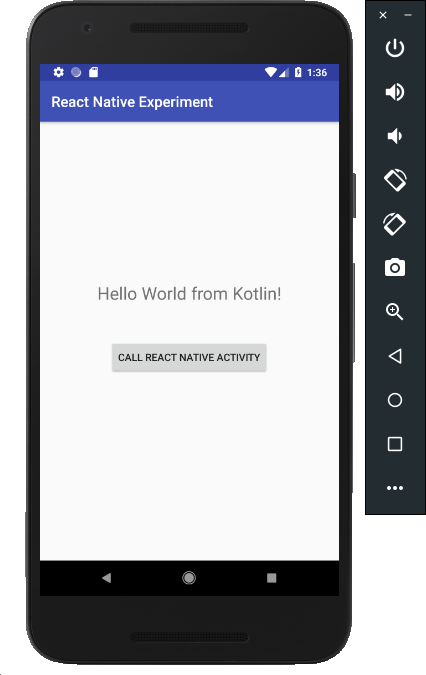
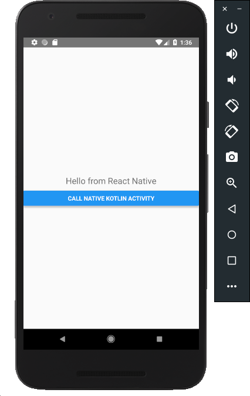

# kotlin-rn-experiment

Android native (Kotlin) and React Native can live together

## Prerequisites

You need to have your **React Native** and **Android** environment ready.

Follow the instructions from [React Native documentation](https://facebook.github.io/react-native/docs/getting-started.html).

You must follow **Building Projects with Native Code** guide.

Choose your **Development OS** as you like and **Target OS** as Android.

At the end of this process, you should have instaled in your machine:

- node
- npm
- watchman
- react-native-cli
- Java 8
- Android Studio (Android SDK is installed by AS)
- yarn (see [this](https://yarnpkg.com/lang/en/docs/install/) for installation instructions)


## Running the app

After cloning the app, you go into the root project folder and run 

```
> yarn 

```

to install JS dependencies.

Then, start Packager server by running: 

```
> yarn start 

```

After that, you can open the Android project on Android Studio and run it.

You can also do this using the command line.

```
> cd android
> ./gradlew installDebug

```

After that, you will be able to navigate between those two screens.

  

